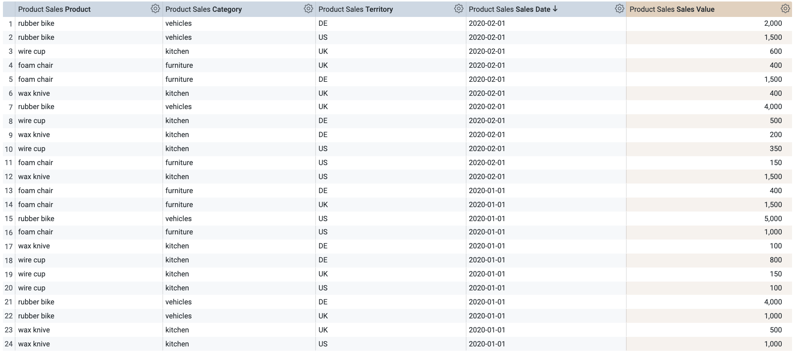

# Sorting pivots by measure / sorting by column totals / dynamic top n ranking

In Looker it is a challenge to sort a table by a row total when a measure is pivoted and the row limit is hit.
[Mollie Lippsett](https://community.looker.com/members/molly-lippsett-3783) provided a great collection of workarounds in one of her Knowledge Drops [here](https://community.looker.com/technical-tips-tricks-1021/list-of-workarounds-for-sorting-pivots-by-measure-sorting-by-column-totals-dynamic-top-n-ranking-26052).

In this post I want to share a generalization of Workaround #1 (Derived table with rank window function).
Essentially the solution proposed here is equal to the solution proposed in [Sort by Pivots Rank with Other Bucket and Percentile Tail Analysis](https://help.looker.com/hc/en-us/articles/360024267673-Sort-by-Pivots-Rank-with-Other-Bucket-and-Percentile-Tail-Analysis) with a few additions.

## The Solution

In this example I am using a simplified sales order model: 

`PRODUCT_SALES(product, category, territory, day, sales_value)`.



For simpler reproducibility I am adding some sample data right into the view.

```lookml
view: product_sales {
  derived_table: {
    sql: WITH product_sales AS (
        SELECT "wax knive" AS product, "kitchen" as category, DATE("2020-01-01") as sales_date, "US" as territory, 1000 as sales_value UNION ALL
        SELECT "wax knive" AS product, "kitchen" as category, DATE("2020-01-01") as sales_date, "UK" as territory, 500 as sales_value UNION ALL
        SELECT "wax knive" AS product, "kitchen" as category, DATE("2020-01-01") as sales_date, "DE" as territory, 100 as sales_value UNION ALL
        SELECT "wax knive" AS product, "kitchen" as category, DATE("2020-02-01") as sales_date, "US" as territory, 1500 as sales_value UNION ALL
        SELECT "wax knive" AS product, "kitchen" as category, DATE("2020-02-01") as sales_date, "UK" as territory, 400 as sales_value UNION ALL
        SELECT "wax knive" AS product, "kitchen" as category, DATE("2020-02-01") as sales_date, "DE" as territory, 200 as sales_value UNION ALL
        SELECT "rubber bike" AS product, "vehicles" as category, DATE("2020-01-01") as sales_date, "US" as territory, 5000 as sales_value UNION ALL
        SELECT "rubber bike" AS product, "vehicles" as category, DATE("2020-01-01") as sales_date, "UK" as territory, 1000 as sales_value UNION ALL
        SELECT "rubber bike" AS product, "vehicles" as category, DATE("2020-01-01") as sales_date, "DE" as territory, 4000 as sales_value UNION ALL
        SELECT "rubber bike" AS product, "vehicles" as category, DATE("2020-02-01") as sales_date, "US" as territory, 1500 as sales_value UNION ALL
        SELECT "rubber bike" AS product, "vehicles" as category, DATE("2020-02-01") as sales_date, "UK" as territory, 4000 as sales_value UNION ALL
        SELECT "rubber bike" AS product, "vehicles" as category, DATE("2020-02-01") as sales_date, "DE" as territory, 2000 as sales_value UNION ALL
        SELECT "foam chair" AS product, "furniture" as category, DATE("2020-01-01") as sales_date, "US" as territory, 1000 as sales_value UNION ALL
        SELECT "foam chair" AS product, "furniture" as category, DATE("2020-01-01") as sales_date, "UK" as territory, 1500 as sales_value UNION ALL
        SELECT "foam chair" AS product, "furniture" as category, DATE("2020-01-01") as sales_date, "DE" as territory, 400 as sales_value UNION ALL
        SELECT "foam chair" AS product, "furniture" as category, DATE("2020-02-01") as sales_date, "US" as territory, 150 as sales_value UNION ALL
        SELECT "foam chair" AS product, "furniture" as category, DATE("2020-02-01") as sales_date, "UK" as territory, 400 as sales_value UNION ALL
        SELECT "foam chair" AS product, "furniture" as category, DATE("2020-02-01") as sales_date, "DE" as territory, 1500 as sales_value UNION ALL
        SELECT "wire cup" AS product, "kitchen" as category, DATE("2020-01-01") as sales_date, "US" as territory, 100 as sales_value UNION ALL
        SELECT "wire cup" AS product, "kitchen" as category, DATE("2020-01-01") as sales_date, "UK" as territory, 150 as sales_value UNION ALL
        SELECT "wire cup" AS product, "kitchen" as category, DATE("2020-01-01") as sales_date, "DE" as territory, 800 as sales_value UNION ALL
        SELECT "wire cup" AS product, "kitchen" as category, DATE("2020-02-01") as sales_date, "US" as territory, 350 as sales_value UNION ALL
        SELECT "wire cup" AS product, "kitchen" as category, DATE("2020-02-01") as sales_date, "UK" as territory, 600 as sales_value UNION ALL
        SELECT "wire cup" AS product, "kitchen" as category, DATE("2020-02-01") as sales_date, "DE" as territory, 500 as sales_value
      )

      SELECT * FROM product_sales
       ;;
  }

  measure: count {
    type: count
    drill_fields: [detail*]
  }

  dimension: product {
    type: string
    sql: ${TABLE}.product ;;
  }

  dimension: category {
    type: string
    sql: ${TABLE}.category ;;
  }

  dimension: sales_date {
    type: date
    datatype: date
    sql: ${TABLE}.sales_date ;;
  }

  dimension: territory {
    type: string
    sql: ${TABLE}.territory ;;
  }

  dimension: sales_value {
    hidden: yes
    type: number
    sql: ${TABLE}.sales_value ;;
  }

  measure: total_sales_value {
    type: sum
    label: "Sales Value"
    sql: ${sales_value} ;;
  }
  set: detail {
    fields: [product, category, sales_date, territory, sales_value]
  }
}
```

The desired outcome is to have the top `n` (over a given set of dimensions) sorted in descending order by their total sales value while pivoting over any of the other available dimensions. All filters should be bound to produce the expected result.

This solution is working with the assumption that the amount of products exceeds the maximum limit for row totals in Looker (5000).

At first, as described in [Sort by Pivots Rank with Other Bucket and Percentile Tail Analysis](https://help.looker.com/hc/en-us/articles/360024267673-Sort-by-Pivots-Rank-with-Other-Bucket-and-Percentile-Tail-Analysis), we need a derived table that allow to calculate the totals but ignores the dimension we pivot by.

To be fully flexible with the dimensions pivoted, a `yesno` parameter is introduced for every dimension indicating its pivot status. In an ideal world liquid would allow to query for this information using something like `.is_pivoted` similar to `.is_filtered`.

```lookml
view: sqldt_dynamic_sum {
  derived_table: {
    sql:
      SELECT
         dynamic_sales.product, 
         dynamic_sales.category, 
         dynamic_sales.sales_date, 
         dynamic_sales.territory, 
        1 as helper,
        SUM(dynamic_sales.sales_value) as sales_value,
      FROM
        product_sales as dynamic_sales
      WHERE
         AND  dynamic_sales.product,  
         AND  dynamic_sales.category,  
         AND  dynamic_sales.sales_date,  
          AND  dynamic_sales.territory,  
        1=1
        -- adding filters for all dimensions we want to filter by
      GROUP BY
         dynamic_sales.product, 
         dynamic_sales.category, 
         dynamic_sales.sales_date, 
         dynamic_sales.territory, 
        helper
      -- the following lines speed up the query but they also result in limited outcome
      ORDER BY sales_value DESC
      LIMIT 
       ;;
  }

  parameter: top_n {
    default_value: "2"
    type: number
  }

  # in an ideal world a liquid reference .is_pivoted makes this obsolete
  parameter: is_product_pivot{
    default_value: "no"
    type: yesno
  }

  parameter: is_category_pivot{
    default_value: "no"
    type: yesno
  }

  parameter: is_sales_date_pivot{
    default_value: "no"
    type: yesno
  }

  parameter: is_territory_pivot{
    default_value: "no"
    type: yesno
  }

  dimension: product {
    hidden: yes
    type: string
    sql: ${TABLE}.product ;;
  }

  dimension: category {
    hidden: yes
    type: string
    sql: ${TABLE}.category ;;
  }

  dimension: sales_date {
    hidden: yes
    type: date
    datatype: date
    sql: ${TABLE}.sales_date ;;
  }

  dimension: territory {
    hidden: yes
    type: string
    sql: ${TABLE}.territory ;;
  }

  dimension: sales_value {
    label: "Sort Dimension"
    type: number
    sql: ${TABLE}.sales_value ;;
  }

}
```

In the explore, the join clause needs to be equally dynamic:

```lookml
include: "product_sales_raw.view.lkml"
include: "sqldt_dynamic_sum.view.lkml"

explore: sort_by_row_totals {
  from: product_sales
  group_label: "Exploration"
  label: "Product Sales with dynamic Sum"
  view_label: "Product Sales"

  # due to the dynamic nature of the where clause in the join its obvious that it should take place only afer the aggregate aware
  join: sqldt_dynamic_sum {
    view_label: "Dynamic Sum"
    type: left_outer # if you do not need the option to group all not top x into a group called other, then use an inner join as it further increases the performance 
    relationship: many_to_one
    sql_on: 1=1
       AND ${sort_by_row_totals.product} = ${sqldt_dynamic_sum.product} 
       AND ${sort_by_row_totals.category} = ${sqldt_dynamic_sum.category} 
       AND ${sort_by_row_totals.sales_date} = ${sqldt_dynamic_sum.sales_date} 
       AND ${sort_by_row_totals.territory} = ${sqldt_dynamic_sum.territory} 
    ;;
  }
}
```


Further generalizing this solution to multiple measures using an additional parameter to select the sort measure is relatively straight forward.

## Alternative Solution

Very much the same outcome can be produced using a window function. While it's a lot less code, there will be a significant dip in performance for larger tables when the amount of partitions increases and `n` is small.

In this case the sort dimension is of type measure and it will be pivoted as well while showing the same value in every column group.
It then must be hidden from the visualization which is another disadvantage of this solution.

```lookml
  measure: dynamic_sales_value_for_territories {
    description: "A dimension containing the total sales value dynamically
    in pivot visualizations to allow sorting by a row total when the row limit of over 5000 rows is reached."
    type: number
    sql: SUM(SUM(${TABLE}.sales_value)) OVER (PARTITION BY
       ${product},  
       ${category}, 
       ${sales_date}, 
      --  ${territory},   # manually excluding the dimension that will be pivoted by 
      1 -- helper
    )
    ;;
  }
```


